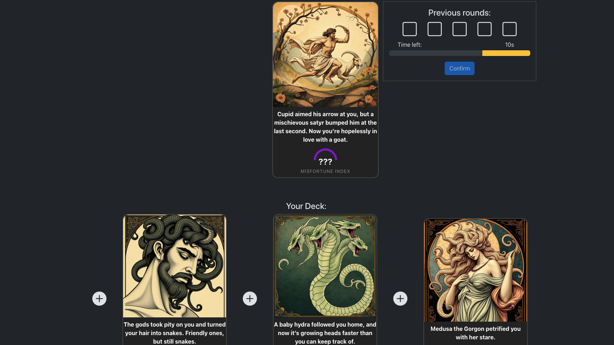
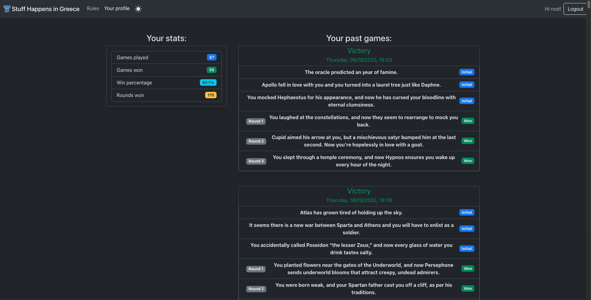

[](https://classroom.github.com/a/uNTgnFHD)
# Exam #1: "Gioco della Sfortuna"
## Student: s343748 Benvenuti Alessandro

- [Exam #1: "Gioco della Sfortuna"](#exam-1-gioco-della-sfortuna)
  - [Student: s343748 Benvenuti Alessandro](#student-s343748-benvenuti-alessandro)
  - [React Client Application Routes](#react-client-application-routes)
  - [API Server](#api-server)
  - [Database Tables](#database-tables)
    - [Table: CARD](#table-card)
    - [Table: MATCH](#table-match)
    - [Table: USER](#table-user)
  - [Main React Components](#main-react-components)
  - [Screenshot](#screenshot)
    - [Gameplay Example](#gameplay-example)
    - [Profile Page](#profile-page)
  - [Users Credentials](#users-credentials)


## React Client Application Routes

- Route `/`: this route leads to the Homepage, which is supposed to be the first page an user can see when he wants to play. From here both authenticated and unauthenticated users can start playing the game. All the functionalities of the navbar all available in this page.
- Route `/rules`: this route leads to the rule page. It can be accessed by both authenticated and unathenticated users in order to read about the rules of the game.
- Route `/login`: this rout leads to the page were a user can authenticate. This page allows only to perfrom login, but there is still no support for the registration of a new user. Login requires username and the password.
- Route `/match/current`: this route leads to the page were a user can perform the actual gameplay. This page behaves differently if the user is authenticated or not.
  - Authenticated: the user can see a covered card at the top of the page while the cards in his hand at the bottom. Near the covered card there is a window showing the state of the game, displaying for each round if it won, lost or it is still to be played, and a button to start a new round. When pressing this button the timer is shown and the user has 30 seconds to choose where to place the card. After confirming his choice he either wins or lose the round. Also if the timer runs out he automatically loses. If he wins 3 rounds he wins the game and he can start a new one or return to the homepage, but if he loses three times he also loses the game. After completing the game a window appears showing the cards he won.
  - Unauthenticated: the user can see a covered card at the top of the page while the cards in his hand at the bottom. Near the covered card there is a window showing a button to start a new round. When pressing this button the timer is shown and the user has 30 seconds to choose where to place the card. After confirming his choice he either wins or lose the round. Since he is an unauthenticated user a window appears telling that the demno ends here and that he has to login to continue playing.
- Route `/profile`: This route can only be accessed by logged in users and leads to the profile page of the user. The page shows the statistics based on the past matches of the user and the hystory of all the games he played, displaying for each one the cards he won and the ones he lost.
- Route `*`: default 404 route.

## API Server

- POST `/api/sesions`: logs in the user
  - request body: {"username": ..., "password", ...}
  - resposne body:
    - if the credentials are correct {"id": ..., "Username": ...} with status 201
    - if the credentials are incorrect {"error": "Incorrect username or password."} with status 401

- GET `/api/sesions/current`: returns the current authenticated user
  - no parameters required.
  - resposne body:
    - if authenticated {"id": ..., "Username": ...} with status 200
    - if unauthenticated {"error": "Not authenticated"} with status 401

- DELETE `/api/sessions/current`: logs out the user by destroying teh session
  - no paramtyers required
  - no content in the response, just status 200 

- GET `/api/matches/current`: API to retrieve the last game or create a new one. Searches if there is an unfinished game for the user, otherwise it creates a new one. It can only be accessed by an authenticated user.
  - no paramteres required
  - reponds with the current match, formatted in order to contain the following paramters:

    ```json
    {
      "MID": "...",
      "UID": "...",
      "Timestamp": "...",
      "cards": [
        {
          "cid": "...",
          "name": "...",
          "picture": "...",
          "value": 42,
          "won": 1
        },
        ...
      ],
      "win": "..."
    }
    ``` 
    Where MID is the Id of the match, UID is the user Id, Timestamp is the timestamp when the match was created, cards is an array of cards and win is a flag used to show if the match is either won, lost or incomplete (null). For each card we have the id, the name, the route of the picture, its value and the flag won, used to tell if the round associated with that card was won or lost.

- PUT `/api/matches/:id`: API to draw a new card for the match. It can only be accessed by an authenticated user.
  - receives the match id as a request paramter
  - responds with the current match, updtaed with the new card which has just been drawn from the deck
    ```json
    {
      "MID": "...",
      "UID": "...",
      "Timestamp": "...",
      "cards": [
        {
          "cid": "...",
          "name": "...",
          "picture": "...",
          "value": 42,
          "won": 1
        },
        ...,
        {
          "cid": "...",
          "name": "...",
          "picture": "...",
          "value": "???",
          "won": null
        }
      ],
      "win": "..."
    }
    ``` 
    The card which has just been drawn has "value": "???" so that an user cannote determine its value even by cheating and looking at the server response.

- POST `/api/matches/:id`: API to check if the round is won or lost and evenbtually if the game is won or lost. It can only be accessed by an authenticated user.
  - receives the match id as a request paramter. In the body ther are the indexes of the two adjacent cards.
    ```json
    {
      "upper": "...",
      "lower": "..."
    }
    ```
  - responds with the current match, properly updated in order to tell if the round is won or lost and even if the entire game is won, lost or still to be finished. So it updtades the field "won" of the last drawn card and eventually the field "win" of the match.

- GET `/api/matches/guest`: API to create a match for a guest user. It can only be accessed by an unauthenticated user.
  - no paramteres required
  - respondes with a simplified version of the match, since only one round has to handled
    ```json
    {
      "MID": null,
      "UID": null,
      "Timestamp": "...",
      "cards": [
        {
          "cid": "...",
          "name": "...",
          "picture": "...",
          "value": 42,
          "won": 1
        },
        ...
      ]
    }
    ``` 

- POST `/api/matches/guest/draw`: API to draw a random card for a gest user
  - receives the 3 cards of the current match in the body
    ```json
    {
      "c1": "...",
      "c2": "...",
      "c3": "..."
    }
    ```
  - responds with the current match, updtaed with the new card which has just been drawn from the deck and as before the value of the card is not sent

- POST `/api/matches/guest/round`: API to check if the guest round is won or lost
  - receives the lower index the upper index and the Id of the card
    ```json
    {
      "lower": "...",
      "upper": "...",
      "cid": "..."
    }
    ```
  - responds with a message telling if the round is either won or lost
    ```json
    {
      "message": "Round lost",
      "card": "...",
      "round": "lost",
      "match": "lost"
    }
    ```

- GET `/api/ptofile`
  - no paramteters required
  - replies with the history of all the games played by the user, sorted in order to have the most recent first
    ```json
      [
        {
          "MID": "...",
          "UID": "...",
          "Timestamp": "...",
          "cards": [
            {
              "cid": "...",
              "name": "...",
              "picture": "#",
              "value": -1,
              "won": 1
            },
            ...
          ],
          "win": 1 
        },
        ...
      ]
    ```
    "picture" is always "#" and "value" is -1 since they are both hidden in the history and in this may there is no way an user can cheat to look them up.


## Database Tables

### Table: CARD

| Column  | Type    | Description                |
|---------|---------|---------------------------|
| CID     | INTEGER | Primary key, unique card id, autoincrement |
| Name    | TEXT    | Card name (not null)      |
| Picture | TEXT    | Path to card image (not null) |
| Value   | REAL    | Misfortune value (not null) |

### Table: MATCH

| Column    | Type    | Description                                 |
|-----------|---------|---------------------------------------------|
| MID       | INTEGER | Primary key, unique match id, autoincrement |
| UID       | INTEGER | Foreign key to USER.UID (not null)          |
| Timestamp | TEXT    | Match creation timestamp (not null)         |
| C1        | INTEGER | Card 1 id (not null)                        |
| C2        | INTEGER | Card 2 id (not null)                        |
| C3        | INTEGER | Card 3 id (not null)                        |
| C4        | INTEGER | Card 4 id                                   |
| C5        | INTEGER | Card 5 id                                   |
| C6        | INTEGER | Card 6 id                                   |
| C7        | INTEGER | Card 7 id                                   |
| C8        | INTEGER | Card 8 id                                   |
| W4        | INTEGER | Round 1 won/lost flag                       |
| W5        | INTEGER | Round 2 won/lost flag                       |
| W6        | INTEGER | Round 3 won/lost flag                       |
| W7        | INTEGER | Round 4 won/lost flag                       |
| W8        | INTEGER | Round 5 won/lost flag                       |
| Win       | INTEGER | 1=win, 0=lose, NULL=incomplete              |

### Table: USER

| Column   | Type    | Description                                 |
|----------|---------|---------------------------------------------|
| UID      | INTEGER | Primary key, unique user id, autoincrement  |
| Username | TEXT    | User's username (unique, not null)          |
| Password | TEXT    | User's hashed password (not null)           |
| Salt     | TEXT    | Salt for password hashing (not null)        |

## Main React Components

- `Homepage` (in `Homepage.jsx`):
  - used in Route `/`
  - It shows the homepage with the button to start playing
  - Welcomes the user

- `RulePage` (in `rulePage.jsx`):
  - used in Route `/rules`
  - It displays the game rules with images and explanations.
  - Helps the user understand how the game works.

- `MatchPage` (in `matchPage.jsx`):
  - used in Route `/match/current`
  - It manages and displays the current game, including the covered card, the player's hand, the timer, and the game state.
  - Handles the gameplay logic, round progression, and shows the win/lose modal at the end.

  - `DisplayMatch` (in `matchPage.jsx`):
    - used inside `MatchPage`
    - It renders the main game interface: covered card, deck, round state, timer, and action buttons.
    - Organizes the visual layout and user interactions during a match.

  - `WinModal` (in `matchPage.jsx`):
    - used inside `MatchPage`
    - It displays a modal when the game is won or lost, showing the cards collected and options to start a new game or return home.
    - Provides end-of-game feedback and navigation.

  - `SendSelectedForm` (in `matchPage.jsx`):
    - used inside `DisplayMatch`
    - It renders the form for submitting the chosen position for the new card.
    - Handles user input and submission for card placement.

  - `displayCard` (helper in `matchPage.jsx`):
    - used in various rendering functions inside `MatchPage` and helpers
    - It renders a single card with its image, name, and value.
    - Provides a reusable way to display card details.

  - `displayCoveredCard` (helper in `matchPage.jsx`):
    - used in `DisplayMatch`
    - It renders the placeholder for the covered card to be placed.
    - Visually separates the card to be guessed from the rest of the deck.

  - `displayDeckCards` (helper in `matchPage.jsx`):
    - used in `DisplayMatch`
    - It renders the player's current hand and the buttons to select the insertion position.
    - Manages the interactive deck display and selection logic.

  - `displayPastRounds` (helper in `matchPage.jsx`):
    - used in `DisplayMatch`
    - It renders the outcome of previous rounds (won/lost).
    - Gives the player a quick overview of their progress in the match.

  - `EmptyColButton` (helper/component in `matchPage.jsx`):
    - used in `displayDeckCards`
    - It renders a button for selecting where to insert the new card.
    - Handles the user's selection of the card placement position.

- `Cardpage` (in `cardpage.jsx`):
  - used wherever you want to display a list of cards
  - It renders a list of all available cards, showing their image, name, and value.
  - Allows users to see a card in a beautiuful way.

  - `displayCard(card)` (helper in `cardpage.jsx`):
    - used inside `Cardpage`
    - It renders a single card with its image, name, and value.
    - Provides a reusable way to display card details in the card list.

- `Profilepage` (in `profilePage.jsx`):
  - used in Route `/profile`
  - It displays user statistics and match history.
  - Allows the user to review their performance and past games.

  - `displayMatch(match, index)` (helper in `profilePage.jsx`):
    - used inside `Profilepage`
    - It renders a card with details of a past match.
    - Provides a reusable way to display match history.

- `LoginForm` (in `authComponents.jsx`):
  - used in Route `/login`
  - It renders the login form.
  - Allows the user to authenticate.

- `LogoutButton` (in `authComponents.jsx`):
  - used in `Navhead` when the user is logged in
  - It renders the logout button.
  - Allows the user to log out.

- `NotFoundPage` (in `notFoundPage.jsx`):
  - used in Route `*`
  - It displays a simple 404 error message when the user navigates to a non-existent route.
  - Provides a button to return to the homepage.


## Screenshot

### Gameplay Example



### Profile Page



## Users Credentials

- username: "root", password: "rootpassword"
- username: "asterix", password: "obelix"
